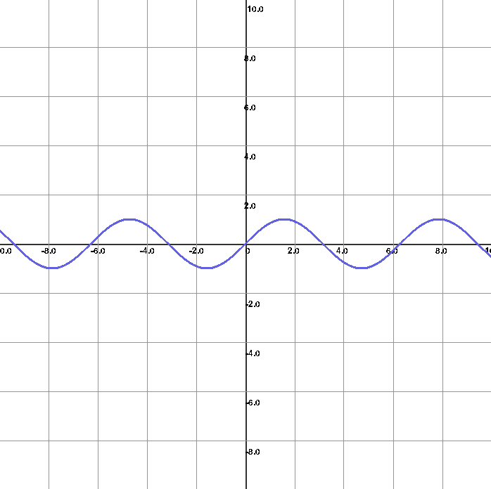
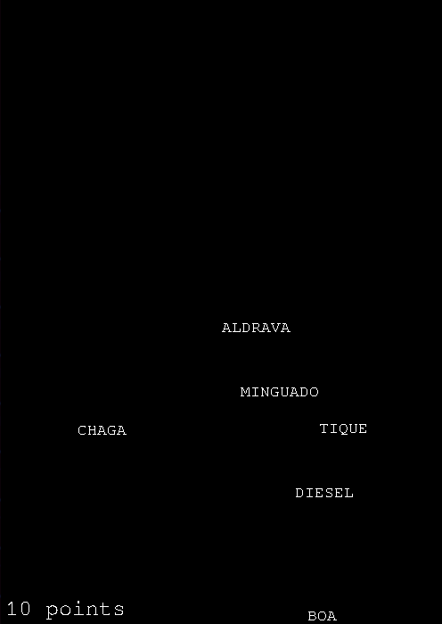
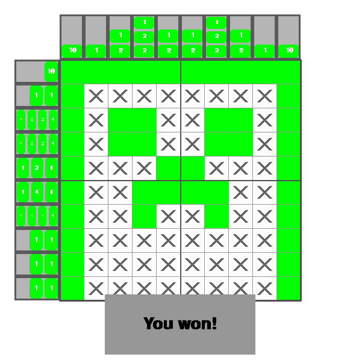
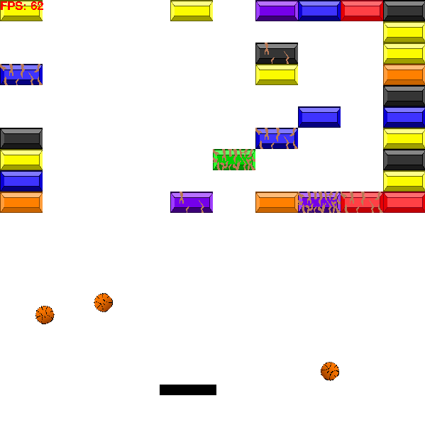

# pygame

Basic projects i've made with PyGame throughout the years.

 - Some of them are a single Python file and you can run them directly
 - Others are in a separate folder and are supposed to be executed via their main.py file

### Graph

`graph.py` graphs a function on the cartesian plan. Example with `f(x) = sin(x)`:

 

`type_racer/` is a game where words start falling from the top and the user has to type them before they touch the ground:

 

`nonogram/` is a game based on the game Nonogram/Logic Pix, where the user has to paint the image pixels based on the tips from the sides:

 

`brick_pong/` is a recreation of the famous brick pong game where the user has to break the bricks with a ball:

